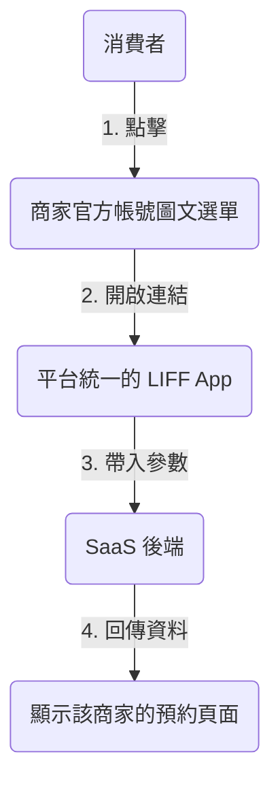

# LIFF 多租戶架構與官方帳號整合指南 (LIFF Multi-Tenancy Guide)

## 1. 核心疑問解答

### Q1: 我們可以自動取得商家的 LINE Developer 權限嗎？
**答案：不行。**
LINE 目前沒有開放 API 允許第三方平台自動建立 Login Channel 或 LIFF App。商家必須手動操作，這違背了「零設定」的產品目標。

### Q2: 商家已經有官方帳號 (OA)，一定要用我們的嗎？
**答案：不用。**
商家繼續使用他們現有的官方帳號（無論是灰盾、藍盾或綠盾）。我們的系統與商家的 OA 是「並行」的關係，而非「取代」。

### Q3: 多個商家共用一個 LIFF App 會被封號嗎？
**答案：不會。**
這是 LINE 官方允許且推薦的 SaaS 架構模式。市面上知名的預約/點餐系統（如 inline, Ocard, 91APP）皆採用此模式。
*   **風險點**：如果 LIFF 網頁內容涉及詐騙、違法或大量發送垃圾訊息，才會導致 App 被停權。
*   **安全性**：只要我們的應用程式內容是正規的預約服務，完全沒有封號風險。

---

## 2. 推薦架構：BYO-OA (Bring Your Own Official Account)

我們採用 **「平台提供工具 (LIFF)，商家提供入口 (OA)」** 的混合模式。

### 架構圖解

### 運作流程
1.  **平台端 (我們)**：
    *   申請一個 LIFF ID (例如：`1657000000-AbCdEfGh`)。
    *   設定 Endpoint URL 指向我們的 C 端網頁 (例如：`https://salon.com/booking`).
2.  **商家端 (老闆)**：
    *   登入我們的 B 端後台。
    *   系統產生專屬連結：`https://liff.line.me/1657000000-AbCdEfGh?tenant_id=store_123`。
    *   老闆複製這個連結。
3.  **整合 (Integration)**：
    *   老闆到 **LINE Official Account Manager** (一般行銷後台)。
    *   設定「圖文選單 (Rich Menu)」或「自動回覆訊息」。
    *   將上述連結貼上。
4.  **消費者端**：
    *   加入商家的 LINE。
    *   點擊選單上的「立即預約」。
    *   開啟 LIFF，系統讀取 `tenant_id=store_123`，顯示該店家的 Logo 與服務。

### 優點分析
| 項目 | 說明 |
| :--- | :--- |
| **商家操作難度** | ⭐ (極低) - 僅需複製貼上連結，無需接觸 Developer Console。 |
| **品牌一致性** | ⭐⭐⭐⭐ (高) - 入口在商家 LINE 內，網頁內顯示商家 Logo。 |
| **開發維護成本** | ⭐ (低) - 僅需維護一組 LIFF Channel。 |
| **封號風險** | 🛡️ (安全) - 符合 LINE Platform 規範。 |

---

## 3. 進階優化：自動化連結設定 (Messaging API)

雖然我們不能自動建立 Channel，但如果商家願意授權 **Messaging API**，我們可以幫他「自動設定圖文選單」。

*   **流程**：
    1.  商家在 B 端後台點擊「連結 LINE OA」。
    2.  跳轉至 LINE Login (Bot Mode) 進行授權。
    3.  我們取得 `Channel Access Token`。
    4.  我們呼叫 LINE Messaging API，直接幫商家把「預約按鈕」寫入他的圖文選單。
*   **代價**：商家需要開啟 Messaging API 功能（這通常需要一點點技術設定，或者我們提供詳細教學）。

**建議策略**：
初期採用 **「手動複製連結」** 模式，這是門檻最低、相容性最高的做法。待產品成熟後，再推出「一鍵授權」的高級功能。
